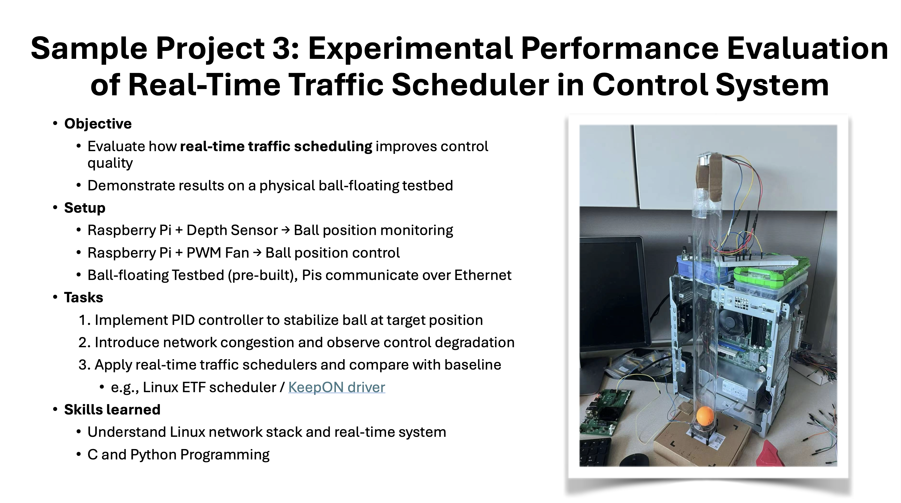

# IoT-RTS (Real-Time Scheduler) Evaluation

This repository contains the code and documentation for a course project on the Architecture of Internet of Things (IoT).

## Project Overview
The primary goal of this project is to experimentally evaluate how a **real-time traffic scheduler** improves the control quality of a physical system. The project uses a **ball-floating testbed** consisting of two **Raspberry Pi Compute Modules** to demonstrate the effects of network congestion and the subsequent performance gains from applying a real-time scheduler.

## Setup
The experimental setup includes a pre-built ball-floating testbed.
* One Raspberry Pi, equipped with a **depth sensor**, monitors the ball's position (Sensor Node `beta`).
* The second Raspberry Pi, connected to a **PWM fan**, controls the ball's position (Actuator Node `alpha`).

The two Raspberry Pis communicate with each other over a **Wi-Fi** network.

## Project Phases
This project is divided into four main phases, each with a key milestone.

* **Phase 1: Project Initiation & PID Control Implementation**
    * **Milestone:** Proposal Submission (September 27)
    * **Activities:** Finalize the project plan, acquire necessary materials, and implement the baseline **PID controller** to stabilize the ball. 

* **Phase 2: Performance Degradation Baseline**
    * **Milestone:** Successful demonstration of network congestion and performance degradation.
    * **Activities:** Introduce network congestion on the **Wi-Fi** link and record the resulting control quality degradation. This establishes our baseline for performance. 

* **Phase 3: Real-Time Scheduler Evaluation**
    * **Milestone:** Implementation of the real-time traffic scheduler and collection of performance data.
    * **Activities:** Implement and apply a **real-time traffic scheduler** (e.g., Linux ETF or KeepON) to the network. Conduct experiments to compare the improved control performance against the degraded baseline. 

* **Phase 4: Analysis & Final Report**
    * **Milestone:** Final project report and presentation submission (December 12).
    * **Activities:** Analyze all collected data, focusing on key trade-offs in cost, power, and performance. Prepare the final report and presentation for submission. 

## Hardware and Software 
* **Hardware**:
    * **Testbed**: A pre-built ball-floating testbed.
    * **Compute**: Two **Raspberry Pi Compute Module 4** boards. 
    * **Sensors**: A depth sensor for ball position monitoring.
    * **Actuators**: A PWM fan for position control.
    * **Networking**: **Wi-Fi** for communication.

* **Software**: 
    * **Operating System**: Raspberry Pi OS Lite (64-bit)
    * **Programming Languages**: **C** and **Python**. 
    * **Scheduling Tools**: Linux ETF scheduler or KeepON driver.
    * **Libraries**: Required libraries for PID control, sensor data acquisition, and fan control.

## Team
* **Abby Horning**
* **Jake Thurman**
* **Chuanyu Xue** (Project Owner)

## Project Motivation
The physical testbed design and baseline control are based on the initial starting project by [Salzmann et al. (2025)](https://doi.org/10.26434/chemrxiv-2025-328tk), but the advanced objectives (real-time scheduling and network evaluation) are derived from Chuanyu's course project idea.

 

## System Design Attribution

The physical ball-floating testbed design and original baseline code (found in the [`/orig`](/orig) directory) are based on the **"PingPongPID"** system described by [Salzmann et al. (2025)](https://doi.org/10.26434/chemrxiv-2025-328tk).

The original source is licensed under **Creative Commons Attribution-NonCommercial-NoDerivatives 4.0 International** [(CC BY-NC-ND 4.0)](https://creativecommons.org/licenses/by-nc-nd/4.0/). Our project is a derivative work, focusing on advanced network scheduling evaluation, and is conducted strictly for non-commercial educational purposes.

## License
 

This derivative work (all files outside of `/orig`) is licensed under the [MIT License](LICENSE).
